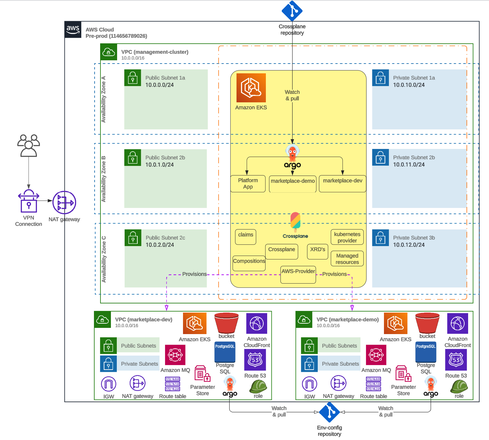

# crossplane


## What is Crossplane?

https://docs.crossplane.io/latest/getting-started/introduction/

Crossplane connects your Kubernetes cluster to external, non-Kubernetes resources, and allows platform teams to build custom Kubernetes APIs to consume those resources.

Crossplane creates Kubernetes CustomResourceDefinitions (CRDs) to represent the external resources as native Kubernetes objects. As native Kubernetes objects, you can use standard commands like kubectl create and kubectl describe. The full Kubernetes API is available for every Crossplane resource.

Crossplane also acts as a Kubernetes Controller to watch the state of the external resources and provide state enforcement. If something modifies or deletes a resource outside of Kubernetes, Crossplane reverses the change or recreates the deleted resource.

With Crossplane installed in a Kubernetes cluster, users only communicate with Kubernetes. Crossplane manages the communication to external resources like AWS, Azure or Google Cloud.

## Add your files

- [ ] [Create](https://docs.gitlab.com/ee/user/project/repository/web_editor.html#create-a-file) or [upload](https://docs.gitlab.com/ee/user/project/repository/web_editor.html#upload-a-file) files
- [ ] [Add files using the command line](https://docs.gitlab.com/ee/gitlab-basics/add-file.html#add-a-file-using-the-command-line) or push an existing Git repository with the following command:

```
cd crossplane
git remote add origin https://gitlab.vesttoo.com/sw/devops/crossplane.git
git branch -M master
git push -uf origin master
```


***

## Name
Vesttoo crossplane

## Description
We will use crossplane to manage our infra-structure.

## Architecture
Below is the architecture design we will implement,
we will use 2 crossplane system one for pre-production to manage all non-prod resources and one 
production crossplane to create the production resources.


## How to create argocd application?
you can use the `argo_application.yaml` file located in the root folder to create the needed argocd application.

example: 
`kubectl apply -f argo_application.yaml`
## Wiki
https://vesttoo.atlassian.net/wiki/spaces/DEVOPS/pages/171540550/Crossplane

## Prerequisites
1. AWS CLI
2. Kubectl
3. Terraform >=v1.0.0

## Authors and acknowledgment
Vesttoo DevOps.
